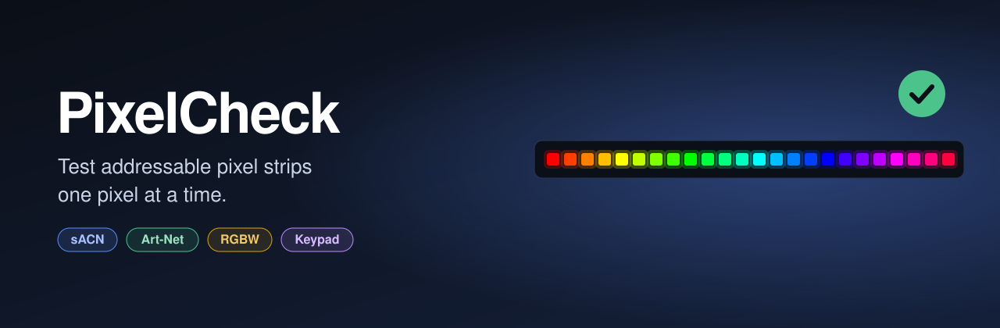
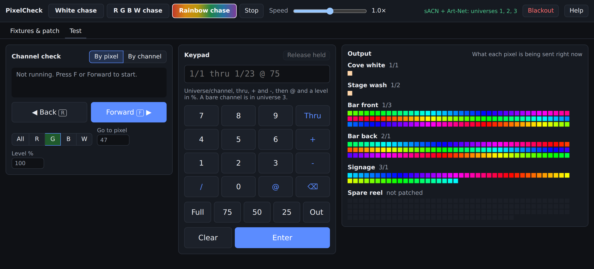
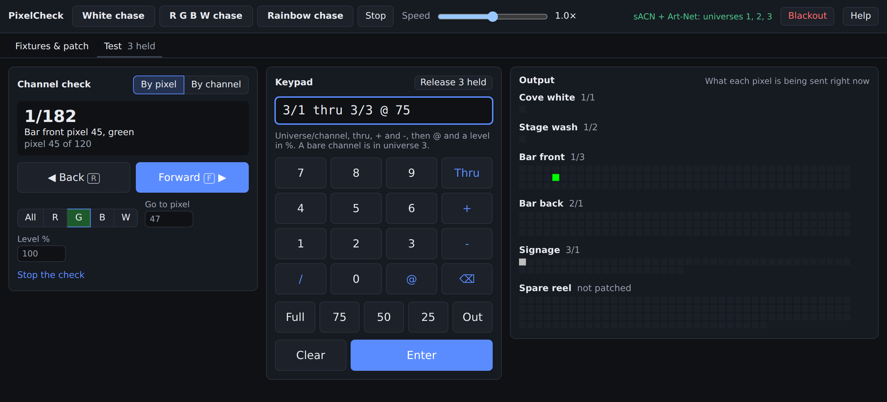
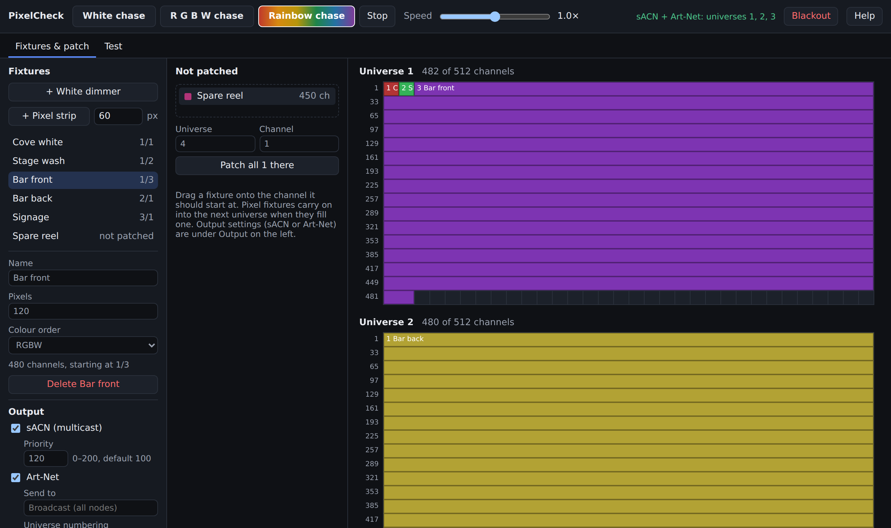

<p align="center">
  
</p>

<p align="center">
  <a href="https://github.com/Krono5/PixelCheck-releases/releases/latest"></a>
  
</p>

<p align="center">
  <a href="https://github.com/Krono5/PixelCheck-releases/releases/latest"><b>Download the latest version</b></a>
  &nbsp;·&nbsp;
  <a href="https://krono5.github.io/PixelCheck-releases/">Website</a>
  &nbsp;·&nbsp;
  <a href="#download-and-install">Install</a>
  &nbsp;·&nbsp;
  <a href="#features">Features</a>
  &nbsp;·&nbsp;
  <a href="#support">Support</a>
</p>

---



## What it's for

You've just hung a run of pixel tape, or you're commissioning a controller, and you need to know that
every pixel is addressed right, every colour channel is in the right order, and nothing is dead.
PixelCheck is built for that job and nothing else. There's no show to program and no controller to
configure: patch your strips, press a button, and walk the run.

## Features

### Channel check, forward and back
Step through the rig with **F** (forward) and **R** (back) from anywhere in the app.
- **By pixel** lights one pixel at a time in patch order: all channels at once, or just **R**, **G**,
  **B** or **W** to prove the colour order.
- **By channel** lights one raw DMX channel at a time, whether anything is patched there or not.
- Set the test level, or jump straight to a pixel or address.



### Console-style keypad
Type levels the way you would on a lighting desk:

| Command | Does |
| --- | --- |
| `1/1 thru 1/23 @ 75` | Universe 1, channels 1 to 23 at 75% |
| `1/5 + 1/9 @ full` | Two channels at full |
| `2/1 thru 2/512 - 2/100` | A whole universe except one channel |
| `1/511 thru 2/4 @ out` | Ranges can cross universes |
| `@ 50` | The last selection at 50% |

Keypad levels sit on top of everything else until you release them.

### Three test chases
**White chase**, **R G B W chase** and **Rainbow chase**, with a speed control from 0.1× to 10×.
Chases follow patch order, so a gap or a jump in the chase shows you exactly where the problem is.

### Drag-and-drop patch


- **Pixel strips** in RGBW, RGB, GRB or any other colour order, with any pixel count.
- **White dimmer** channels for single-colour fixtures.
- Drag a fixture onto the channel it starts at; long strips carry on into the next universe by themselves.
- Overlaps and bad addresses are flagged as you patch.

### Output your way
- **sACN (E1.31)** by multicast, with a **priority** from 0 to 200 so you can test over a running
  show or step in front of a console.
- **Art-Net** broadcast to every node or sent to one node's IP address, with Art-Net universe 0 or 1
  numbering to match your gear.
- A live **output view** shows what every pixel is being sent right now.
- **Blackout** stops everything and releases held channels in one click.

### Looks after itself
- Your fixtures, patch and output settings are saved automatically.
- PixelCheck **updates itself**: when a new version comes out, it installs and restarts at launch.
- Built-in **Help** (press **F1**) covers every screen.

## Download and install

Get the newest version from the [**Releases page**](https://github.com/Krono5/PixelCheck-releases/releases/latest).

| System | File |
| --- | --- |
| **macOS** (Apple silicon and Intel) | `PixelCheck_x.y.z_universal.dmg` |
| **Windows** 10 and 11 (64-bit) | `PixelCheck_x.y.z_x64-setup.exe` or `PixelCheck_x.y.z_x64_en-US.msi` |

**macOS:** open the `.dmg` and drag PixelCheck into Applications.

**Windows:** run the installer.

<details>
<summary><b>macOS says it can't check the app, or that it's damaged</b></summary>

Open **System Settings › Privacy & Security**, scroll down and click **Open Anyway**. You only need to
do this once. If macOS says the app is damaged, run this in Terminal:

```
xattr -dr com.apple.quarantine /Applications/PixelCheck.app
```
</details>

<details>
<summary><b>Windows says it protected your PC</b></summary>

SmartScreen shows this for new apps. Click **More info**, then **Run anyway**.
</details>

Your computer needs to be on the same network as your pixel controllers. For sACN multicast, that
usually means a wired connection on the lighting network.

## Licence

PixelCheck needs a licence key, activated once per computer.

1. Buy a licence and the key arrives by email.
2. Open PixelCheck and paste the key into the **Activate** screen.
3. To move it to a different computer, open **Help** and choose **Move to another computer**,
   then activate the key there.

PixelCheck checks the licence online when it starts and keeps working offline for up to 30 days.

## Support

Found a problem or have an idea? [Open an issue](https://github.com/Krono5/PixelCheck-releases/issues)
and include your PixelCheck version (shown at the bottom of Help) and your operating system.

---

<p align="center">
  Copyright © 2026 Tyler Storr. All rights reserved.<br>
  PixelCheck is proprietary software. This repository hosts downloads only.
</p>
